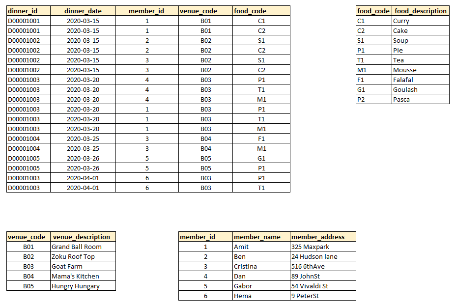

1. **Exercise- 1**

```
+-----------+---------------+----------------+-----------+-------------+------------+-------------------+-----------+------------------+
| member_id | member_name   | member_address | dinner_id | dinner_date | venue_code | venue_description | food_code | food_description |
+-----------+---------------+----------------+-----------+-------------+------------+-------------------+-----------+------------------+
|         1 | Amit          | 325 Max park   | D00001001 | 2020-03-15  | B01        | Grand Ball Room   | C1, C2    | Curry, Cake      |
|         2 | Ben           | 24 Hudson lane | D00001002 | 2020/03/15  | B02        | Zoku Roof Top     | S1, C2    | Soup, Cake       |
|         3 | Cristina      | 516 6th Ave    | D00001002 | 2020/03/15  | B02        | Zoku Roof Top     | S1, C2    | Soup, Cake       |
|         4 | Dan           | 89 John St     | D00001003 | 20-03-2020  | B03        | Goat Farm         | P1, T1, M1| Pie, Tea, Mousse |
|         1 | Amit          | 325 Max park   | D00001003 | 20-03-2020  | B03        | Goat Farm         | P1, T1, M1| Pie, Tea, Mousse |
|         3 | Cristina      | 516 6th Ave    | D00001004 | Mar 25 '20  | B04        | Mama's Kitchen    | F1, M1    | Falafal, Mousse  |
|         5 | Gabor         | 54 Vivaldi St  | D00001005 | Mar 26 '20  | B05        | Hungry Hungary    | G1, P2    | Goulash, Pasca   |
|         6 | Hema          | 9 Peter St     | D00001003 | 01-04-2020  | B03        | Goat Farm         | P1, T1, M1| Pie, Tea, Mousse |
+-----------+---------------+----------------+-----------+-------------+------------+-------------------+-----------+------------------+
```
1. `What columns violate 1NF?`.
* There are 4 rules in 1NF.
* **All data must be atomic (every column should only contain a single value)** : food_code and food_description columns violate 1NF
* **Repeating columns are not allowed :** 
* **Prevent duplicate records (by applying primary keys):**At the table , member_names 'Amit' and 'Cristina' are repeating
* **Attribute domain should not change (all values in a column must be of the same kind or type):** in the dinner_date column dates` format is not same in the each row.For example : (01-04-2020 and Mar 26 '20)
2. `What entities do you recognize that could be extracted?`
* We can extract below columns from the table
* member_name , 
* member_address, 
* venue_description, 
* food_description

3. `Name all the tables and columns that would make a 3NF compliant solution.`
* Third Normal Form requires not have Transitive Dependency.
member_name and member_address columns are transitive dependant to dinner_id through member_id, venue_description is transitive dependant to dinner_id to dinner_id through venue_code.
*  There should be four tables
 1. Dinner Table {dinner_id, dinner_date, venue_code , food_code} dinner_date, venue_code , food_code columns should be foreign keys
 2. Member Table {member_id, member_name, member_address}
 3. Venue Table{venue_code, venue_description}
 4. Food Table{food_code, food_description}
 More, in Dinner Table , dinner_date should be in same date format, in Dinner Table - food_code column in one field , there should only one food code, for others there should be other rows
Four Tables 

